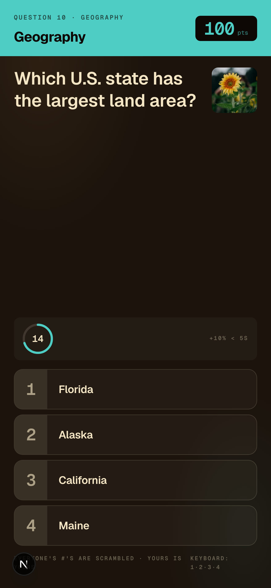

# TR1VIA

Live trivia, designed to make the room feel alive.

> **Status:** Publicly accessible at [tr1via.com](https://tr1via.com). This repository does not claim paid events or verified venue adoption.

One host action updates three synchronized surfaces: the host controls, the venue display, and player phones. The public proof is the deployed product, the realtime recovery design, and multi-context Playwright tests that exercise those surfaces together.

<p align="center">
  
</p>

## How it's built

AI-assisted and human-verified. Brandon directs implementation and owns the product decisions, realtime behavior, failure handling, and verification. Tests and observable behavior decide when the work is accepted.

## Stack

- **Next.js 16** + React 19 + TypeScript (App Router)
- **Tailwind CSS v4** + CSS custom properties for theme tokens
- **Supabase** (Postgres + Realtime + Auth + Storage)
- **Claude API** for question generation
- **Pexels** for auto-attached question photos
- **Vercel** for deploy (preview per PR)

## Run locally

```bash
# 1. Install deps
npm install

# 2. Start local Supabase
brew install supabase/tap/supabase   # one-time
supabase start                       # boots local Postgres + Realtime + Studio

# 3. Copy env, fill in keys
cp .env.example .env.local
# Get NEXT_PUBLIC_SUPABASE_URL + keys from `supabase status`
# Get ANTHROPIC_API_KEY + PEXELS_API_KEY from each provider
# Generate SESSION_SECRET: openssl rand -base64 48

# 4. Apply migrations + generate types
supabase db reset
npm run typegen

# 5. Run
npm run dev    # http://localhost:3000
```

## Project structure

```
app/                  Next.js routes (player + host + tv surfaces)
components/system/    Design-system atoms (TR1VIA wordmark, PointTag, AnswerCard, …)
components/player/    Player phone screens
components/tv/        Venue TV screens
components/host/      Host phone + laptop screens
lib/theme/            14 themed palettes + per-month weather
lib/game/             Pure game logic (scramble, score, timer, …)
lib/supabase/         DB clients (browser / server / admin)
lib/ai/               Claude API integration
supabase/migrations/  SQL schema
tests/                Vitest unit + Playwright E2E
```

## Tests

```bash
npm test               # unit tests (Vitest)
npm run test:e2e       # E2E (Playwright, including multi-context sync tests)
```

## What this is

The production app behind tr1via.com, shared as technical proof rather than as a drop-in template. It is actively developed.

## Deploy

Vercel creates a preview deployment for each pull request. Production is `tr1via.com`.
